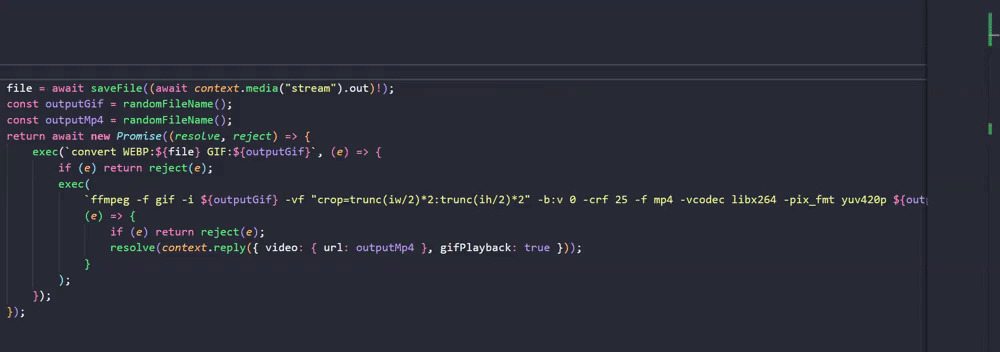
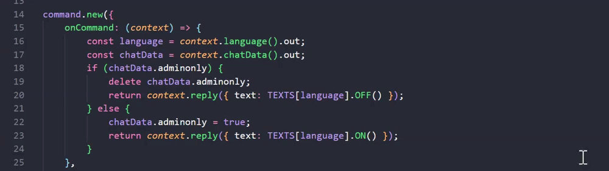
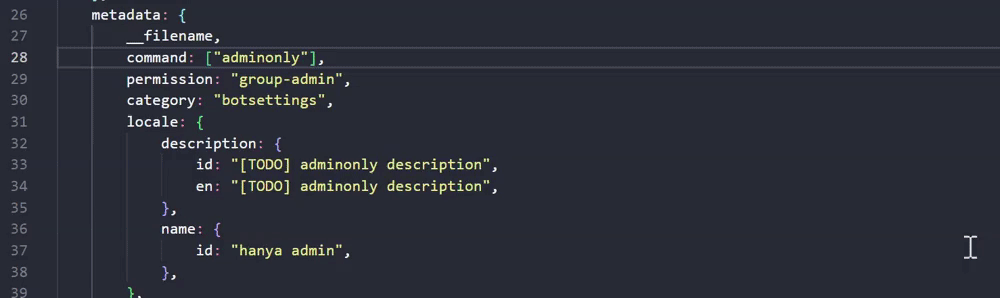

# miki-whatsapp-bot 

Another WhatsApp bot with super clean code design. Written in TypeScript.

&nbsp;
&nbsp;

>Download and send messages

>Create new commands


> Aaaaand much more


&nbsp;
&nbsp;

## Requirements (Prerequisites)

-   Node.JS
-   Imagemagick
-   FFMpeg
-   Libwebp (for running webpmux and dwebp)

## Cloning
```sh
git clone https://github.com/riozee/miki-whatsapp-bot
cd miki-whatsapp-bot
```

## `.env` Configurations
Before running, make sure to create `.env` file in the bot folder and paste this configurations.

```sh
# the bot number itself (NECESSARY)
BOT_NUMBER="1234567890"
# your number (NECESSARY)
OWNER_NUMBER="1234567890"
# the number people will contact to buy Premium
CUSTOMER_SERVICE_NUMBER="1234567890"
# the number to receive the feedback when a user sent a feedback using /feedback command
# (can be a group) (ends it with @g.us if it's a group)
FEEDBACK_NUMBER="1234567890"
# bot will send a backup copy of the database every minute. This is the number to send to
# (can be a group) (ends it with @g.us if it's a group)
DATABASE_BACKUP_NUMBER="1234567890"
# everytime there is an error in command, bot will send a report to this number
# (can be a group) (ends it with @g.us if it's a group)
ERROR_REPORT_NUMBER="1234567890"
# prefix of the bot
PREFIX="!@#$%^&*"
```

## Run

```sh
npm install
npm run build
npm start
```

## Features

| No  | Name                    | Permission    | Status |
| --- | ----------------------- | ------------- | ------ |
| 1   | about                   | all           | ✔      |
| 2   | addpremium              | all-owner     | ✔      |
| 3   | echo/say                | all           | ✔      |
| 4   | adminonly               | group-admin   | ✔      |
| 5   | premium                 | all           | ✔      |
| 6   | ban                     | all-owner     | ✔      |
| 7   | stats                   | all           | ✔      |
| 8   | getbackup               | all-owner     | ✔      |
| 9   | ev                      | all-owner     | ✔      |
| 10  | feedback                | all           | ✔      |
| 11  | help                    | all           | ✔      |
| 12  | language                | private-admin | ✔      |
| 13  | menu                    | all           | ✔      |
| 14  | premium                 | all-owner     | ✔      |
| 15  | sleep                   | group-admin   | ✔      |
| 16  | sticker/sticker/s       | all           | ✔      |
| 17  | unsticker/unsticker/uns | all           | ✔      |
| 18  | batchsticker            | all (premium) | ✔      |
| 19  | batchunsticker          | all (premium) | ✔      |

## How to Contribute
If you'd like to contribute, please fork the repository and make changes as you'd like. Pull requests are warmly welcome.
Steps to contribute:
1. Fork this repository
2. Create your feature branch (git checkout -b feature/newFeature)
3. Commit your changes (git commit -am 'Add some feature ...')
4. Push to the branch (git push origin feature/newFeature)
5. Create a new Pull Request

## Authors
Rioze [](https://t.me/riozee) 

## License
```
MIT License

Copyright (c) 2022-2023 Rioze

Permission is hereby granted, free of charge, to any person obtaining a copy
of this software and associated documentation files (the "Software"), to deal
in the Software without restriction, including without limitation the rights
to use, copy, modify, merge, publish, distribute, sublicense, and/or sell
copies of the Software, and to permit persons to whom the Software is
furnished to do so, subject to the following conditions:

The above copyright notice and this permission notice shall be included in all
copies or substantial portions of the Software.

THE SOFTWARE IS PROVIDED "AS IS", WITHOUT WARRANTY OF ANY KIND, EXPRESS OR
IMPLIED, INCLUDING BUT NOT LIMITED TO THE WARRANTIES OF MERCHANTABILITY,
FITNESS FOR A PARTICULAR PURPOSE AND NONINFRINGEMENT. IN NO EVENT SHALL THE
AUTHORS OR COPYRIGHT HOLDERS BE LIABLE FOR ANY CLAIM, DAMAGES OR OTHER
LIABILITY, WHETHER IN AN ACTION OF CONTRACT, TORT OR OTHERWISE, ARISING FROM,
OUT OF OR IN CONNECTION WITH THE SOFTWARE OR THE USE OR OTHER DEALINGS IN THE
SOFTWARE.
```